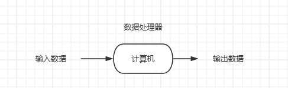
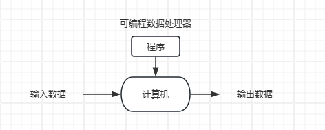
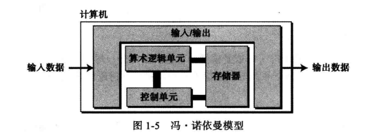

计算机科学是研究与计算机相关问题的一门学科，那么什么是计算机呢？

# 计算机模型

## 图灵模型

阿兰图灵于1937年提出了一个通用计算设备的设想：所有的计算都可能在一种特殊的机器上执行，这种机器称为图灵机。图灵模型建立在人们进行计算的行为上，并对这些行为进行了抽象。

注意：阿兰图灵在<<论可计算数及其在判定问题上的应用>>里对图灵机进行了数学上的描述，但是并没有构建真实的机器。

**数据处理器**

数据处理器：接受输入数据，处理数据，产生输出结果的黑盒。

这个模型可以体验现代计算机的功能，缺点是：

1. 定义太宽泛
2. 模型并没有说明处理的类型，是否可以处理一种以上的类型？ 也就是说 是专用机器还是通用机器呢？

**可编程数据处理器**

图灵模型是适用于通用计算机的更好模型，她添加了一个额外元素-程序到计算机中。

程序：指示计算机对数据进行处理的指令集合，也就是：输入+程序=输出

**通用图灵机**

通用图灵机是对现代计算机的首次描述，该机器只要提供了合适的程序就能做任何运算。

## 冯诺依曼模型

从上面看出，基于图灵模型的机器，程序是存储在计算机外部的。1944-1945年期间，冯诺依曼提出，鉴于程序和数据在逻辑上是相同的，因此程序也能存储在计算机中。

图灵机中，程序是通过操作一系列的开关或改变其配线来实现的，而冯诺依曼模型中，程序是由一组数量有限的指令组成，计算机只需要按顺序执行指令即可。

模型的要求：

1. 程序必须存储在计算机中
2. 程序必须是有序的指令集

# 现代计算机

计算机模型只是描述了计算机的理论组成，但是并没有限制具体的实现。现代计算机基本都是基于冯诺依曼模型，主要由硬件、数据、软件三部分组成，接下来我们一一进行介绍。

## 组成

### 硬件

计算机硬件主要分为以下几部分：

* CPU：包含算数逻辑单元和控制单元
* 存储器：存储程序和数据
* 输入输出

### 数据

模型并没有定义数据如何存储。现代计算机将外界的数据转换成01代码后存储在计算机中，输出时再进行转换。

### 软件

软件分为两种：

1. 操作系统：管理计算机硬件与软件资源的程序集合
2. 应用软件：为了满足用户在不同领域和场景下的具体需求而开发的软件

# 历史

## 机械计算机器

（1930 年以前）

- 17 世纪，法国数学家布莱斯・帕斯卡（Blaise Pascal）发明了 “Pascsline”，是用来进行加减运算的机器。
- 17 世纪后期，德国数学家戈特弗里德・莱布尼茨（Gottfried Leibniz）发明了能做乘除运算和加减运算的 “莱布尼茨之轮”。
- 19 世纪初期，约瑟夫 - 玛丽・雅卡尔（Joseph-Marie Jacquard）发明了雅卡尔提花织机，利用穿孔卡控制织布过程中经线的提升，利用了存储和编程概念。
- 1823 年，查尔斯・巴比奇（Charles Babbage）发明了差分引擎，能进行数学运算、解多项式方程，后来又发明了分析引擎，有制造场（类似算术逻辑单元）、存储单元、操作者（控制单元）和输出单元，和现代计算机概念类似。
- 1890 年，赫尔曼・何勒里斯（Herman Hollerith）设计并制造出具有编程能力的机器，可自动阅读、计数和排列存储在穿孔卡上的数据。

## 电子计算机

（1930～1950 年）

- 早期的电子计算机：程序存储在计算机外部
  - 1939 年，约翰・阿塔纳索夫（John Atanasoff）及其助手克利福德・贝里（Clifford Berry）发明了 “ABC”（阿塔纳索夫 - 贝里计算机），用于解线性方程系统。
  - 同一时期，德国数学家康拉德・朱斯（Konrad Zuse）设计出通用计算机 “Z1”。
  - 20 世纪 30 年代，美国海军和 IBM 公司在哈佛大学发起创建了一项工程，在霍华德・艾肯（Howard Aiken）的直接领导下发明建造了一台名为 MarkⅠ 的巨型计算机，这种计算机既使用了电子部件，也使用了机械部件。
  - 英国阿兰・图灵（Alan Turing）发明了 “巨人” 计算机，用于破译德国Enigma 密码。
  - 1946 年，约翰・莫奇勒（John Mauchly）和普雷斯波・埃克特（J. Presper Eckert）发明了第一台通用的、完全电子的计算机 “ENIAC”。
- 基于冯・诺依曼模型的计算机
  - 1950 年，宾夕法尼亚大学诞生了第一台基于冯氏思想的计算机 “EDVAC”，英国剑桥大学的莫里斯・威尔克斯（Morris Wilkes）制造了同样类型的 “EDSAC” 计算机。

## 现代计算机

（1950 年至今）

- **第一代计算机（大约 1950～1959 年）**：以商用计算机的出现为主要特征，使用真空管作为电子开关，体积庞大，只有大机构能负担得起，只有专家才能使用。
- **第二代计算机（大约 1959～1965 年）**：使用晶体管代替真空管，体积减小、成本降低，中小型企业也能负担得起，“FORTRAN” 和 “COBOL” 两种高级计算机程序设计语言发明，使编程更容易。
- **第三代计算机（大约 1965～1975 年）**：集成电路发明，计算机成本和大小进一步降低，小型计算机出现，软件包开始有售，软件工业诞生。
- **第四代计算机（大约 1975～1985 年）**：出现微型计算机，第一个桌面计算器 “Altair 8800” 在 1975 年出现，电子工业发展使整个计算机子系统可做在单块电路板上，还出现了计算机网络。
- **第五代计算机（始于 1985 年）**：见证了掌上计算机和台式计算机的诞生、第二代存储媒体的改进、多媒体的应用以及虚拟现实现象。

# 计算机科学

随着计算机的发明，带来了新的学科：计算机科学，主要划分为几个领域：

* 系统领域：与硬件和软件构成直接相关的领域，例如：
  * 计算机体系结构
  * 计算机网络
  * 安全问题
  * 操作系统
  * 算法
  * 程序设计语言
  * 软件工程
* 应用领域：与计算机使用相关的领域，例如：
  * 数据库
  * 人工智能

# 课后习题

