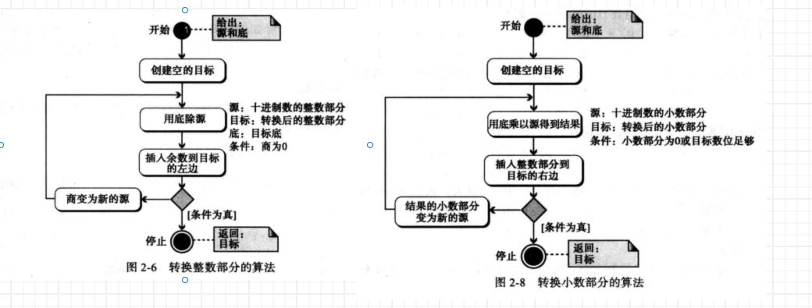

数字系统定义了如何用独特的符号表示一个数字，主要分为：

* 位置化数字系统：符号占据的位置决定了表示的值，如十进制、二进制
* 非位置化数字系统：

# 位置化数字系统

数字的表示方法：
$$
n=±(S_{k-1}...S_1S_0...S{-l})_{b}=±(S_{k-1}\times b^{k-1} + ...+S_1 \times b^1 + S_0 \times b^0 +....+S_{l-1} \times b^{l
-1})
$$
其中，S是一套符号集，b是底(基数)，等于S符号集中的符号数。

## 进制

* 十进制：日常生活中我们使用的就是十进制，一般情况下省略圆括号、底和正号。数码k能表示的十进制整数的最大值=$10^k - 1$
* 二进制：数据和程序是以二进制模式存储于计算机中的，原因是计算机由电子开关制成，他们只有开和关两种状态，存储0和1。
* 十六进制：二进制太长，不便于在计算机外部表示数字，因此发明了16进制，字符集(0-9,ABCDEF)，刚好16个数，一般只用来表示整数
* 八进制：与十六进制类似，0-7

## 转换

进制间的转换一般情况下都是以十进制为中介进行转换的。

**其他进制到十进制的转换**

二进制
$$
(110.11)_2 = 1 \times 2^2 + 1 \times 2^1 + 0 \times 2^0 + 1 \times 2 ^{-1} + 1 \times 2^{-2} =  4 +2 + 0 + 0.5 + 0.25 = 6.75
$$
八进制
$$
(110.1)_8 = 1 \times 8^2 + 1 \times 8^1 + 0 \times 8^0 + 1 \times 8 ^{-1}  =  64 + 8 + 0 + 0.125  = 74.125
$$
十六进制
$$
(110.1)_{16} = 1 \times {16}^2 + 1 \times {16}^1 + 0 \times {16}^0 + 1 \times 8 ^{-1}  =  256 + 16 + 0 + 0.125  = 272.0625
$$

**十进制到其他进制的转换**

这里比较特殊，整数和小数分开处理，如下图所示

0.625转换为二进制 $(0.101)_2$ 

简单来说就是：不断地乘以2，然后拆分整数和小数

| 源    | 乘以底 | 整数 | 小数 |
| ----- | ------ | ---- | ---- |
| 0.625 | 2      | 1    | 0.25 |
| 0.25  | 2      | 0    | 0.5  |
| 0.5   | 2      | 1    | 0.0  |

0.634转换为8进制,且精确到4位小数，$(0.5044)_8$

| 源    | 乘以底 | 整数 | 小数  |
| ----- | ------ | ---- | ----- |
| 0.634 | 8      | 5    | 0.072 |
| 0.072 | 8      | 0    | 0.576 |
| 0.576 | 8      | 4    | 0.068 |
| 0.068 | 8      | 4    | 0.272 |

178.6转换为十六进制且精确到1位小数=$(B2.9)_{16}$

| 源   | 除以底 | 整数 | 余数 |
| ---- | ------ | ---- | ---- |
| 178  | 16     | B=11 | 2    |
| 2    | 16     | 2    | 0    |
| 源   | 乘以底 | 整数 | 小数 |
| 0.6  | 16     | 9    | 0.6  |

**小tips**

1. 小的十进制转换为二进制的简便方法：拆解为二进制对应数的和，比如 25 = 16 +8 +1 = $11001$
2. 数码的数量：k=$ \lceil {log_b}^{ N} \rceil $,表示以b进制表示一个整数N需要的整数的数码的数量

# 非位置化数字系统

非位置化数字系统未在计算机中使用，我们可以简要了解一下。

非位置话数字系统仍然使用有限的数字符号，但是符号的值与位置无关。
$$
n=±(S_{k-1}...S_1S_0...S{-l})_{b}=±(S_{k-1} + ...+S_1  + S_0 +....+S_{l-1})
$$
比如罗马数字系统，

S = {Ⅰ，Ⅴ，X，L，C，D，M}，分别表示 1 5 10 50 100 500 1000 

规则如下：

1. 较小的符号位于同等值或较大值的后面时，这些值相加
2. 较小的符号位于较大值前面时，用大值减小的值
3. 如果$s_1$ <= 10 * $s_2$ ，则符号$s_1$ 不能出现在符号$S_2$之前
4. 对于大数字，在除Ⅰ之外的6种符号的任意一个上方加横杠表示乘以1000

